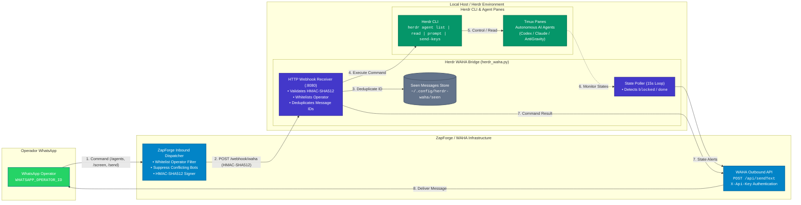

# Herdr WAHA Bridge

Control local Herdr agents from one authorized WhatsApp private chat through [ZapForge](https://zapforge.com.br) or an existing WAHA session. Built with Python's standard library and the installed `herdr` CLI.

---

## Architecture

The bridge forms a secure bidirectional control loop between your WhatsApp and local Herdr agent terminals.



> **Interactive Architecture Diagram:**
> An interactive C4 architectural diagram with dark/light themes, search, and deep trace capabilities compiled with [Archify](https://github.com/tt-a1i/archify) is available in [`docs/architecture.html`](docs/architecture.html) (specification in [`docs/architecture.json`](docs/architecture.json)).

---

## Quick Start with ZapForge

[ZapForge](https://zapforge.com.br) includes built-in support for Herdr WAHA out of the box, with native HMAC-SHA512 request signing, operator whitelisting, and a full WAHA-compatible outbound API (`POST /api/sendText`).

1. In your ZapForge dashboard, navigate to **Canais** &rarr; **Herdr WAHA** (or go to your instance settings &rarr; **Integrações** &rarr; **Herdr WAHA**).
2. Enter your bridge endpoint URL (e.g. `https://your-tunnel.example.com` or `http://127.0.0.1:8080`).
3. Enter your operator WhatsApp phone number (e.g. `5511999999999`).
4. Generate or enter your shared HMAC secret key.
5. Click **Salvar integração** and optionally **Testar conexão**.
6. On your host where Herdr is installed, export the environment variables and run `python3 herdr_waha.py`.

---

## Standalone WAHA Setup

If you run standalone WAHA instead of ZapForge, add this webhook object to your connected session's `config.webhooks` array:

```json
{
  "url": "https://YOUR_HERDR_HOST/webhook/waha",
  "events": ["message"],
  "hmac": { "key": "YOUR_SHARED_SECRET" }
}
```

Set the bridge's `WAHA_WEBHOOK_HMAC_KEY` to the same secret. WAHA sends `X-Webhook-Hmac` with SHA-512; the bridge rejects requests with an invalid signature, wrong session, group chat, or unapproved sender. Fetch the current session configuration before updating it: WAHA's `PUT /api/sessions/{session}` replaces full session configuration. [WAHA webhooks documentation](https://waha.devlike.pro/docs/how-to/events/).

---

## Environment Variables

Configure these in your environment, systemd service, or container runtime:

| Variable | Description | Example |
| --- | --- | --- |
| `WAHA_URL` | Base URL of ZapForge or WAHA | `https://zapforge.com.br` or `https://waha.example.com` |
| `WAHA_API_KEY` | API Key with permission to send messages | `zf_live_...` or your WAHA API key |
| `WAHA_SESSION` | Connected WhatsApp session name | `default` |
| `WAHA_WEBHOOK_HMAC_KEY` | Shared secret key for HMAC-SHA512 verification | `your-secure-secret-key` |
| `WHATSAPP_OPERATOR_ID` | Whitelisted operator WhatsApp ID | `5511999999999@c.us` (auto-appends `@c.us` if omitted) |
| `HERDR_BIN` | Path to the `herdr` CLI binary *(optional)* | `herdr` (default) |
| `HERDR_WA_LISTEN` | Host and port to listen on *(optional)* | `127.0.0.1:8080` (default) |
| `HERDR_WA_STATE` | File path for deduplication store *(optional)* | `~/.config/herdr-waha/seen` (default) |

Run the bridge:
```bash
python3 herdr_waha.py
```
The server will verify local Herdr connectivity on boot.

---

## Operator Commands

Send any of the following commands from the authorized operator WhatsApp account:

| Command | Action | Description |
| --- | --- | --- |
| `/agents` or `/status` | List Agents | Lists active agent panes with status, directory, and index number. |
| `/screen N` | Read Output | Reads the last 60 lines of screen output from agent `N`. |
| `/send N <prompt>` | Send Prompt | Submits a text prompt or instruction to agent `N`. |
| `/keys N <key>` | Send Key | Sends a keystroke (e.g. `Enter`, `y`, `n`, `Escape`) to resolve blocking dialogs. |

### Quoting & Replies
- You can reply directly to any screen card or agent status message with your prompt.
- If your WhatsApp client or WAHA engine omits reply metadata, use `/send N <prompt>`.
- The bridge checks pane and terminal IDs before executing commands to prevent sending instructions to a recycled terminal pane.
- Automatic notifications are dispatched whenever an agent transitions into `blocked` or `done`.

---

## Security & Resilience

- **HMAC-SHA512 Inbound Verification:** Every webhook request is cryptographically verified against tampering using HMAC-SHA512.
- **Operator Whitelisting:** Group chats, community broadcasts, channels, and non-whitelisted senders are rejected before processing.
- **Brazilian Phone Number Normalization:** Tolerant to Brazilian 9th-digit variations (DDI 55 + DDD + 8 or 9 digits) between WhatsApp server routing and operator config.
- **Deduplication:** Processed message IDs are persisted to disk to eliminate command duplication caused by network retries.
- **Zero-Dependency Core:** Implemented purely in standard Python 3 (no third-party pip dependencies required).

---

## Tests

Run the test suite with standard Python unittest:

```bash
python3 -m unittest -v
```
